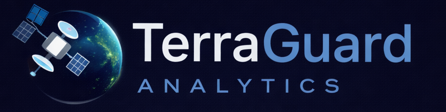

<div align="center">
  
</div>

---

# **ChangeDetection** - Detect Changes in Satellite Imagery Over Time

<div align="center">
  <a href="https://change-detection-gamma.vercel.app/login">
    
  </a>
</div>

An intelligent platform for analyzing and visualizing satellite imagery to detect changes across specified areas of interest. Monitor environmental changes, urban development, and land-use patterns with precision and ease.

---

## 🎯 **Purpose & Need**

### **The Problem**
Modern geospatial surveillance and land monitoring face critical challenges:

- **Manual Monitoring is Impossible** - Countries with massive borders (thousands of km) cannot monitor all regions daily. The sheer volume of satellite imagery requires automation.
- **Geographic Constraints** - Landowners abroad cannot conduct on-site inspections. They need remote monitoring capabilities accessible from anywhere.
- **Environmental Crisis** - Deforestation, forest fires, and natural disasters destroy vast areas. Rapid detection and loss quantification are essential for response and mitigation.
- **Low-Quality Imagery** - Many regions rely on freely available satellite data with varying resolution. The system must work effectively with imperfect imagery.

 

### **Real-World Use Cases**

| Use Case | Benefit |
|----------|---------|
| 🛡️ **Border Patrol** | Detect unauthorized activities, infrastructure breaches, or anomalies across national borders |
| 👨‍🌾 **Land Owners** | Monitor agricultural land, farms, and properties from abroad without travel |
| 🌲 **Environmental Protection** | Track deforestation, forest fires, and illegal logging in real-time |
| 🌍 **Disaster Response** | Calculate damage percentage and loss metrics after natural disasters (floods, earthquakes, hurricanes) |
| 🏗️ **Infrastructure** | Monitor construction projects, urban sprawl, and land-use changes |
| 📊 **Research & Policy** | Provide data-driven evidence for environmental policies and conservation efforts |

---

## 🛰️ **Data & Model Architecture**

### **Data Collection: Sentinel-2 via Copernicus API**

The project uses **Sentinel-2 multispectral satellite imagery** from the European Copernicus Space Program via the **Sentinel Hub API**.

#### **Satellite & Data Specifications**
| Specification | Details |
|---|---|
| **Satellite** | Sentinel-2 A & B (Copernicus Program) |
| **Data Type** | Multispectral Level-2A (Surface Reflectance) |
| **Bands Used** | RGB (Red, Green, Blue) + Scene Classification (SCL) |
| **Resolution** | 10-60m depending on band (primarily 10m RGB) |
| **Coverage** | Global, with ~5-day revisit frequency |
| **Cloud Masking** | Automatic filtering (max 30% cloud cover) |
| **Output Format** | PNG (256x256 standardized) |
| **Free Access** | Yes - Public Copernicus data |

#### **Data Pipeline**
```
1. User selects AOI (Area of Interest) on map
2. Specify two dates (Past & Current)
3. API queries Sentinel Hub for Sentinel-2 imagery
4. Cloud masking applied via EvalScript
5. Images resized to 256x256 pixels
6. Standard normalization applied (0-255 to 0-1)
7. Passed to ML model for change detection
```

#### **Why Sentinel-2?**
✅ **Free & Open** - No licensing costs, public availability  
✅ **Global Coverage** - Covers entire Earth  
✅ **Regular Updates** - Every ~5 days for any location  
✅ **High Resolution** - 10m RGB bands sufficient for macro changes  
✅ **Low Latency** - Near-real-time availability (1-3 days after acquisition)  
✅ **Multi-Spectral** - Rich spectral information for AI analysis  

---

### **Machine Learning Model: Siamese U-Net**

#### **Model Architecture**
ChangeDetection uses a **Siamese U-Net** architecture specifically designed for change detection tasks.

```
INPUT: Two 256×256 RGB satellite images (T1: Past, T2: Current)
                          ↓
                  SIAMESE ENCODER
            (Shared weights for both images)
              ↙ Image 1          ↘ Image 2
        Encoder Block 1      Encoder Block 1
        Encoder Block 2      Encoder Block 2
        Encoder Block 3      Encoder Block 3
                          ↓
                  FEATURE DIFFERENCE
            (Compute |F1 - F2| at each level)
                          ↓
                    DECODER (U-Net)
                (Progressive Upsampling)
                Up-Sample + Concatenate
                Convolution Blocks
                          ↓
         OUTPUT: Binary Change Map (256×256)
         Pixel values: 0 (No Change) → 1 (Changed)
```

#### **Key Features**
| Feature | Details |
|---|---|
| **Architecture** | Siamese U-Net with shared encoder |
| **Input Size** | 256 × 256 RGB (3 channels) |
| **Output** | Binary change map (1 channel, 0-1 range) |
| **Processing** | Encoder extracts multi-scale features from both images |
| **Difference Detection** | Absolute difference between corresponding feature levels |
| **Decoder** | Progressively upsamples difference map to original resolution |
| **Activation** | Sigmoid (0-1 output for pixel-wise change probability) |
| **Model Version** | `siamese_unet_v1` |

---

### **Training Data: LEVIR-CD & OSCD Datasets**

The Siamese U-Net was trained on industry-standard change detection benchmark datasets:

#### **Dataset 1: LEVIR-CD**
| Property | Details |
|---|---|
| **Full Name** | Land-Exoplanet Variable Imagery for Change Detection |
| **Images** | 637 image pairs (1274 total images) |
| **Resolution** | 256 × 256 pixels per image |
| **Coverage** | Texas, USA (urban areas) |
| **Focus** | Building construction, urban development |
| **Changes** | Clear structures, new buildings, demolitions |
| **Challenges** | Seasonal variation, shadows, occlusion |

#### **Dataset 2: OSCD**
| Property | Details |
|---|---|
| **Full Name** | Onera Sentinel-1 Change Detection |
| **Images** | 24 image pairs with multiple temporal observations |
| **Resolution** | 256 × 256 pixels per image |
| **Coverage** | Multiple regions (Beirut, California, etc.) |
| **Focus** | Disaster areas, infrastructure damage |
| **Changes** | Large-scale events, land cover changes |
| **Challenges** | Varying lighting, seasonal changes, atmospheric effects |

#### **Training Process**
```
1️⃣ Preprocessing
   - Normalize pixel values (0-255 → 0-1)
   - Resize images to 256×256
   - Data augmentation (rotation, flip, brightness adjustment)

2️⃣ Loss Function
   - Binary Cross-Entropy (BCE) for pixel-wise classification
   - Dice Loss for handling class imbalance
   - Combined: weighted loss = 0.5*BCE + 0.5*Dice

3️⃣ Optimization
   - Optimizer: Adam with learning rate 1e-3
   - Batch Size: 8-16 images
   - Epochs: 100+ with early stopping
   - Validation: 15% of dataset

4️⃣ Evaluation Metrics
   - Precision, Recall, F1-Score
   - Intersection over Union (IoU)
   - Overall Accuracy
   - Area Under Precision-Recall Curve
```

#### **Why These Datasets?**
✅ **Diverse Change Types** - Buildings, disasters, land-cover  
✅ **Standard Benchmarks** - Used by top change detection research papers  
✅ **High Quality Labels** - Manually annotated ground-truth  
✅ **Public Access** - Freely available for validation  
✅ **Multiple Challenges** - Atmospheric, seasonal, shadow variations  

---

## 📁 **Project Structure**

ChangeDetection is organized into four main components:

```
ChangeDetection/
│
├── 📱 Frontend/                    # Web UI & User Interface
│   ├── vite-project/               # React + Vite application
│   ├── assert/                     # Logo, assets, media
│   └── package.json                # Frontend dependencies
│
├── 🔧 Backend/                     # REST API & Business Logic
│   ├── app.js                      # Express.js server entry point
│   ├── routes/                     # API endpoints (detection, history, etc.)
│   ├── controllers/                # Route handlers
│   ├── services/                   # Sentinel Hub, image processing, database
│   ├── middleware/                 # Authentication, validation
│   ├── models/                     # Database schemas & ORM
│   │   ├── userModel.js            # User table operations
│   │   ├── aoiModel.js             # Area of Interest table operations
│   │   └── historyModel.js         # Detection history operations
│   ├── config/                     # Environment & configuration
│   │   └── db.js                   # PostgreSQL connection pool
│   ├── constants/                  # Error codes, constants
│   ├── utils/                      # Helper functions
│   └── package.json                # Backend dependencies
│
├── 🗄️ Database/                    # PostgreSQL Data Store
│   └── Tables:
│       ├── users                   # User accounts & authentication
│       ├── saved_aois              # Saved Areas of Interest
│       └── detection_history       # Change detection results
│
├── 🤖 PythonService/               # ML Inference Service
│   ├── app.py                      # FastAPI server
│   ├── models/
│   │   ├── model_inference.py      # Siamese U-Net model
│   │   └── siamese_unet_final.pth  # Trained model weights
│   ├── README.md                   # ML service docs
│   └── requirements.txt            # Python dependencies
│
├── 📊 ml-service/                  # Machine Learning Utilities
│   └── [ML processing tools]
│
├── 💾 data/                        # Cached satellite imagery & results
│   └── [UUID folders with detection results]
│
├── 📄 Configuration Files
│   ├── start-all.bat               # Start all services (Windows)
│   ├── start-all.ps1               # Start all services (PowerShell)
│   └── railway.toml                # Railway deployment config
│
└── 📚 Documentation
    ├── README.md                   # This file
    ├── VALIDATION_SYSTEM.md        # Validation rules & logic
    ├── AOI_MANAGER_REFACTOR.md     # AOI feature updates
    └── TEST_AREA_CALCULATION.md    # Area calculation details
```


### **Component Overview**

| Component | Purpose | Tech Stack |
|-----------|---------|-----------|
| **Frontend** | Interactive UI for AOI selection, detection requests, results visualization | React, Vite, Leaflet.js, TailwindCSS |
| **Backend API** | REST API handling requests, Sentinel-2 data fetching, database operations | Node.js, Express.js, PostgreSQL |
| **Database** | Persistent storage for users, AOIs, and detection history | PostgreSQL |
| **ML Service** | Change detection inference using trained Siamese U-Net model | Python, PyTorch, FastAPI |
| **Data Layer** | Caches satellite imagery and detection results for quick retrieval | File storage (local) |

---

## � **Deployments**

ChangeDetection is deployed across multiple cloud platforms for optimal performance, scalability, and cost efficiency:

### **Deployment Architecture Overview**

```
┌─────────────────────────────────────────────────────────────┐
│                        END USERS                            │
└────────────────────┬────────────────────────────────────────┘
                     │
            ┌────────▼────────┐
            │                 │
      ┌─────▼────┐     ┌─────▼────────┐
      │  VERCEL  │     │  NEON (DB)   │
      │  Frontend│     │  PostgreSQL  │
      │ (React)  │     └──────────────┘
      └─────┬────┘
            │ API Calls
      ┌─────▼──────────┐
      │    RAILWAY     │
      │  Backend API   │
      │  (Node.js)     │
      │  Express.js    │
      └─────┬──────────┘
            │
      ┌─────▼──────────────────┐
      │       AZURE            │
      ├────────────────────────┤
      │ • ML Service (FastAPI) │
      │ • Python Service       │
      │ • Model (PyTorch)      │
      └────────────────────────┘
```


### **Deployment Flow Diagram**

```
1. USER INTERACTION (Vercel Frontend)
   ├─ Select AOI on map
   ├─ Choose past & current dates
   └─ Submit detection request

2. API CALL (Railway Backend)
   ├─ Validate input (middleware)
   ├─ Fetch user data from Neon DB
   ├─ Fetch Sentinel-2 images from Copernicus
   ├─ Save images temporarily
   └─ Call ML service

3. ML INFERENCE (Azure Python Service)
   ├─ Load Siamese U-Net model
   ├─ Preprocess images (256x256)
   ├─ Run inference
   ├─ Generate change map & heatmap
   └─ Return results

4. SAVE & DISPLAY (Railway + Vercel)
   ├─ Save detection to Neon DB
   ├─ Store results in file cache
   ├─ Return response to frontend
   └─ Display results to user
```

## 🤝 **Contributing**

We welcome contributions from everyone! Whether you're fixing bugs, adding features, or improving documentation, your help makes ChangeDetection better.

### **How to Contribute**

#### **1. Report Issues & Request Features**
Found a bug or want a new feature? Open an issue on GitHub:

📌 **Steps:**
1. Go to [GitHub Issues](https://github.com/your-repo/issues)
2. Click "New Issue"
3. Provide clear description:
   - **Bug Report**: Describe what went wrong, steps to reproduce, expected behavior
   - **Feature Request**: Explain the feature and why it would be valuable
   - **Improvement Suggestion**: Point out areas for enhancement

**Example Issue Title:**
- `[BUG] Change detection returns incorrect percentage for cloudy images`
- `[FEATURE] Add support for multi-temporal analysis (3+ time periods)`
- `[IMPROVEMENT] Optimize ML model inference speed`


### **Recognition & Encouragement**

⭐ **Star this repository** to show your support and help others discover ChangeDetection!


---

## 📋 **Development Roadmap** (Planned Features)

### **Phase 1: Model Enhancement** 🔧
- [ ] **Specialized Forest Loss Detection Model** - Dedicated CNN optimized for forest cover change detection
- [ ] **Natural Disaster Loss Model** - Separate model trained on earthquake, flood, and fire damage datasets
- [ ] **Seasonal & Cloud Noise Robustness** - Improve model to handle seasonal variations and cloud interference
  - Enhanced cloud masking with multi-spectral analysis
  - Temporal consistency learning for seasonal filtering
  - Synthetic data augmentation for weather conditions

### **Phase 2: Data Integration** 🌍
- [ ] **Bhoonidhi Multi-Temporal Satellite Imagery** - Integrate multi-temporal Earth observation data from Bhoonidhi platform
  - Access historical time-series satellite data for temporal analysis
  - Enhanced change detection across multiple time periods
  - Improved accuracy through sequential imagery comparison

- [ ] **Boundary Data Integration** - Incorporate geopolitical boundaries and administrative borders
  - Auto-detection of AOI boundaries
  - Border surveillance presets

### **Phase 3: Edge & Resilience** 🔌
- [ ] **Edge Device Support** - Deploy models to edge devices (Nvidia Jetson, Coral TPU) for offline processing
- [ ] **Fallback Integration System: SAR & Drones** - Automatic fallback to alternative data sources when cloud services are unavailable
  - **SAR (Synthetic Aperture Radar) Fallback**:
    - Integration with Sentinel-1 SAR data for weather-independent detection
    - All-weather capability (penetrates clouds and rain)
    - Night-time monitoring capability
    - Pre-cached SAR imagery for critical regions
  - **Drone Deployment Fallback**:
    - Integration with drone/UAV systems for high-resolution ground truth
    - Automated drone mission planning for critical AOIs
    - Real-time drone imagery ingestion and processing
    - Edge processing on drone payloads (Nvidia Jetson integration)


---

## 📞 **Contact & Support**

- **Issues & Bugs**: [GitHub Issues](https://github.com/your-repo/issues)
- **Discussions**: [GitHub Discussions](https://github.com/your-repo/discussions)
- **LinkedIn**: [Connect with Sachin](https://www.linkedin.com/in/mr-sachin)

---

## 🙏 **Acknowledgments**

- **Copernicus Program** & **ESA** - Free satellite imagery access
- **PyTorch** - Deep learning framework
- **Railway, Vercel, Neon, Azure** - Cloud infrastructure
- **LEVIR-CD & OSCD** - Change detection datasets
- **Open-source community** - Countless libraries and tools

---
## 👨‍💻 **About the Creator**

<div align="center">
  
</div>

<p align="center">
  <strong>SACHIN M R</strong> - Passionate AI &amp; Machine Learning Enthusiast
</p>

<p align="center">
  I am dedicated to harnessing the power of <strong>Artificial Intelligence</strong> to make people's lives easier and enable autonomous systems across every field. My journey involves deep learning, machine learning, and AI agents.
</p>

<div align="center">

### **Current Focus**

</div>

<p align="center">
  📚 <strong>Learning &amp; mastering Deep Learning architectures</strong><br>
  🤖 <strong>Building AI Agents with advanced reasoning capabilities</strong><br>
  🌍 <strong>Creating autonomous systems for real-world problems</strong><br>
  🛰️ <strong>Satellite imagery analysis &amp; geospatial AI applications</strong>
</p>

<div align="center">

### **Connect & Follow**

  <a href="https://www.linkedin.com/in/mr-sachin">
    
  </a>
  <a href="https://github.com/Sachin-MR05">
    
  </a>
  <a href="https://huggingface.co/mr-sachin">
    
  </a>

</div>

<p align="center">
  Eager to connect for collaborations, internships, and meaningful technical discussions.
</p>

---

<div align="center">

### **Made with ❤️ by Sachin**

*Empowering autonomous systems for a better future*

</div>

